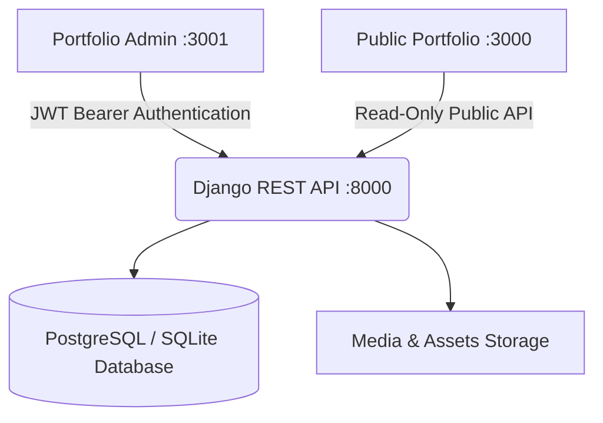

# ⚡ Portfolio Admin — Control Center & CMS

<div align="center">

[](https://nextjs.org/)
[](https://react.dev/)
[](https://www.typescriptlang.org/)
[](https://tailwindcss.com/)
[](https://www.django-rest-framework.org/)
[](https://jwt.io/)

<p align="center">
  <b>A modern, high-performance content management dashboard and control center for managing portfolio data, project showcases, credentials, referees, and résumé timelines.</b>
</p>

[Live Portfolio](https://www.khalfanathman.dev) • [Backend API Docs](http://127.0.0.1:8000/api/v1/docs/) • [Report Bug](https://github.com/AbuArwa001/portfolio-admin/issues)

</div>

---

## 🌟 Overview

**`portfolio-admin`** is the dedicated administrative frontend for Khalfan Athman's portfolio ecosystem. Built with **Next.js 16 (App Router)**, **React 19**, **Tailwind CSS v4**, and **NextAuth.js**, it interfaces directly with a robust **Django REST Framework (DRF)** backend to provide complete CRUD control over all portfolio assets with zero overhead on the public site.



---

## ✨ Key Features

### 🔐 Authentication & Session Security
- **Django REST SimpleJWT Integration**: Direct token exchange (`/api/v1/auth/login/`) and silent token refresh.
- **Role-based Auth Guards**: Full route protection on all `/dashboard/*` endpoints with redirect to login.
- **Glassmorphic Login UI**: Dark-mode sign-in screen with password visibility toggle, input validation, and animated feedback.

### 📁 Projects Management
- **Full CRUD Lifecycle**: Create, edit, preview, and delete project showcases.
- **Direct Image Uploads**: Multipart/form-data upload with instant local preview and remove capability.
- **Rich Metadata**: Status tracking (`Active`, `Completed`, `In Progress`, `Archived`), project categories, completion badges, and comma-separated tech stack tags.

### 🎖️ Certifications & Credentials
- **Credential Tracking**: Manage verified certificates, badges, issuing organizations, and issue dates.
- **Verification Links**: Support for Credly and third-party verification URLs with "In Progress" toggles.

### 💬 References & Endorsements
- **Testimonial Management**: Add and curate referee recommendations with quotes, company/organization names, job titles, and contact information.

### ⚡ Skills & Proficiency Matrix
- **Interactive Stack Sliders**: Adjust proficiency percentages (10%–100%) with real-time visual progress indicators.
- **Category Grouping**: Organize skills across Frontend, Backend, Systems/Networking, and Cloud/DevOps.

### 👤 Profile & Bio Customizer
- **Executive Bio & Headline**: Update professional summaries and titles displayed on the portfolio hero section.
- **Contact & Social Links**: Manage email, phone, location, GitHub, LinkedIn, and custom URLs.

### 📄 Interactive CV & Résumé Editor
- **Timeline Management**: Add, edit, or remove position records, institutions, degrees, and line-by-line bullet achievements.
- **Direct JSON & Cache Sync**: One-click updates that keep downloadable and printable CV formats in sync.

---

## 🛠️ Tech Stack

| Domain | Technology | Purpose |
|---|---|---|
| **Framework** | [Next.js 16 (App Router)](https://nextjs.org/) | Core framework with Turbopack |
| **UI Library** | [React 19](https://react.dev/) | Component architecture |
| **Language** | [TypeScript 5.9](https://www.typescriptlang.org/) | Strict type safety across the dashboard |
| **Styling** | [Tailwind CSS v4](https://tailwindcss.com/) | Modern utility-first CSS design tokens |
| **UI Components** | [Radix UI](https://www.radix-ui.com/) | Accessible unstyled primitives |
| **Icons** | [Lucide React](https://lucide.dev/) & [Tabler Icons](https://tabler.io/icons) | Modern iconography |
| **Motion** | [Framer Motion](https://www.framer.com/motion/) | Micro-animations and page transitions |
| **Notifications** | [Sonner](https://sonner.emilkowal.ski/) | Toast notifications |
| **Charts** | [Recharts](https://recharts.org/) | Data visualization |
| **Authentication** | [NextAuth.js v4](https://next-auth.js.org/) | JWT session handling |
| **Backend Integration** | [Django REST Framework](https://www.django-rest-framework.org/) | RESTful API & JWT token provider |

---

## 📂 Project Structure

```
portfolio-admin/
├── app/
│   ├── api/
│   │   ├── auth/[...nextauth]/route.ts   # NextAuth JWT route handler
│   │   └── upload-profile-image/         # Image upload forwarding proxy
│   ├── auth/
│   │   └── signin/page.tsx               # Login page with ambient glow & validation
│   ├── dashboard/
│   │   ├── layout.tsx                    # Protected admin layout with sidebar & header
│   │   ├── page.tsx                      # Metrics overview & quick navigation
│   │   ├── projects/page.tsx             # Projects CRUD & image upload
│   │   ├── references/page.tsx           # References & testimonials manager
│   │   ├── certifications/page.tsx       # Certifications & credential manager
│   │   ├── skills/page.tsx               # Technical skills & proficiency matrix
│   │   ├── profile/page.tsx              # Bio, contacts, and personal information
│   │   └── cv/page.tsx                   # CV timeline & experience editor
│   ├── globals.css                       # Tailwind v4 theme variables
│   ├── layout.tsx                        # Root layout (Fonts, Providers, Toaster)
│   ├── page.tsx                          # Auth router (redirects to /dashboard or /auth)
│   ├── Providers.tsx                     # SessionProvider & ThemeProvider wrapper
│   └── resume/resume.json                # CV data source
├── components/
│   ├── app-sidebar.tsx                   # Collapsible navigation sidebar
│   ├── site-header.tsx                   # Dashboard top header with status badges
│   ├── auth-guard.tsx                    # Client-side session protector
│   ├── mode-toggle.tsx                   # Dark / Light theme switcher
│   ├── theme-provider.tsx                # next-themes integration
│   └── ui/                               # Accessible UI components (buttons, dialogs, etc.)
├── hooks/
│   ├── use-mobile.ts                     # Viewport detection hook
│   └── use-search.ts                     # Filter & search hook
├── lib/
│   ├── api.ts                            # Typed DRF API client with Bearer auth
│   ├── utils.ts                          # Class name merger utilities
│   └── resume-actions.ts                 # Server actions for CV JSON sync
├── types/
│   ├── index.ts                          # Project, Skill, Cert, UserProfile interfaces
│   └── next-auth.d.ts                    # Extended NextAuth session & JWT types
├── .env.local                            # Environment configuration
├── auth-options.ts                       # NextAuth DRF credentials provider
├── package.json                          # Dependencies and scripts
├── tailwind.config.js                    # Tailwind configuration
└── tsconfig.json                         # TypeScript configuration & path aliases
```

---

## 🚀 Getting Started

### Prerequisites

Ensure you have the following installed on your machine:
- **Node.js**: `v20.x` or `v22.x`
- **npm** or **pnpm** / **yarn**
- **Python 3.12+** & **Django REST Framework** backend running (see [portfolio-backend](https://github.com/AbuArwa001/portfolio-backend))

### 1. Clone the Repository

```bash
git clone https://github.com/AbuArwa001/portfolio-admin.git
cd portfolio-admin
```

### 2. Install Dependencies

```bash
npm install
```

### 3. Configure Environment Variables

Create a `.env.local` file in the root directory:

```env
# NextAuth Configuration
NEXTAUTH_SECRET=your-super-secret-key-change-in-production
NEXTAUTH_URL=http://localhost:3001

# DRF Backend API URL
NEXT_PUBLIC_API_URL=http://127.0.0.1:8000

# Public Portfolio URL
NEXT_PUBLIC_PORTFOLIO_URL=http://localhost:3000
```

### 4. Run Development Server

```bash
npm run dev
```

Open [http://localhost:3001](http://localhost:3001) in your browser.

---

## 🔗 Connected API Endpoints

The admin dashboard communicates with the following Django REST Framework backend routes:

| Method | Endpoint | Description | Auth Required |
|---|---|---|:---:|
| `POST` | `/api/v1/auth/login/` | Obtain JWT access and refresh tokens | ❌ |
| `POST` | `/api/v1/auth/token/refresh/` | Refresh expired access token | ❌ |
| `GET` | `/api/v1/auth/me/` | Fetch authenticated user details | ✅ |
| `GET` / `POST` | `/api/v1/projects/` | List and create portfolio projects | ✅ (POST) |
| `PATCH` / `DELETE` | `/api/v1/projects/{id}/` | Update or delete project with images | ✅ |
| `GET` / `POST` | `/api/v1/references/` | List and create referees | ✅ (POST) |
| `PATCH` / `DELETE` | `/api/v1/references/{id}/` | Update or delete referee endorsement | ✅ |
| `GET` / `POST` | `/api/v1/certifications/` | List and create credentials | ✅ (POST) |
| `PATCH` / `DELETE` | `/api/v1/certifications/{id}/` | Update or delete certification | ✅ |
| `GET` / `POST` | `/api/v1/auth/profile/skills/` | List and update skill proficiencies | ✅ |
| `GET` / `POST` | `/api/v1/auth/profile/update/` | Update bio, avatar, and contact info | ✅ |

---

## 📦 Scripts

| Command | Description |
|---|---|
| `npm run dev` | Starts development server on port `3001` |
| `npm run build` | Compiles optimized production build with Turbopack |
| `npm run start` | Serves production build on port `3001` |
| `npm run lint` | Runs ESLint analysis |

---

## 🤝 Ecosystem Repositories

- **Public Frontend**: [portfolio](https://github.com/AbuArwa001/portfolio)
- **Admin Control Center**: [portfolio-admin](https://github.com/AbuArwa001/portfolio-admin) *(this repository)*
- **API Backend**: [portfolio-backend](https://github.com/AbuArwa001/portfolio-backend)

---

## 👤 Author

**Khalfan Athman**
* Senior Network Engineer & Full-Stack Developer
* Website: [khalfanathman.dev](https://www.khalfanathman.dev)
* GitHub: [@AbuArwa001](https://github.com/AbuArwa001)
* LinkedIn: [khalfaniathman](https://www.linkedin.com/in/khalfaniathman)

---

## 📄 License

This project is open-sourced under the [MIT License](LICENSE).
